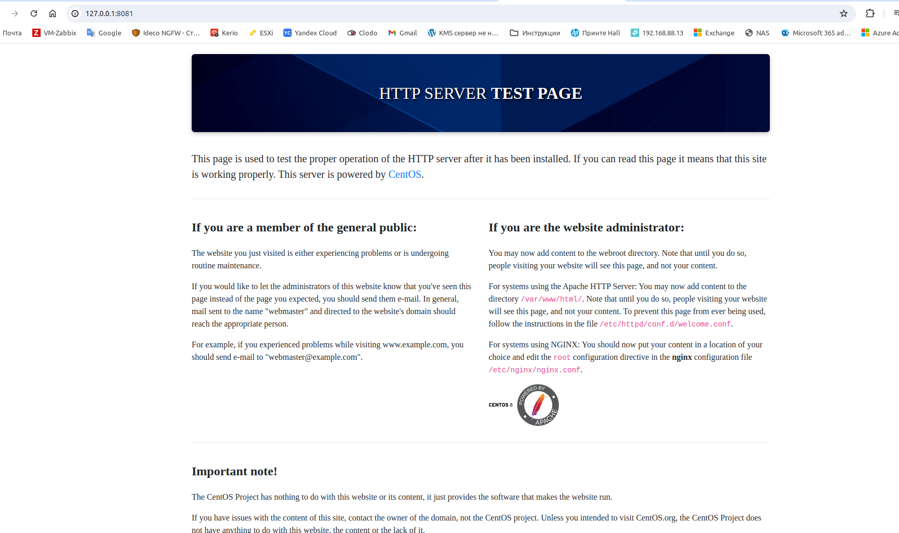
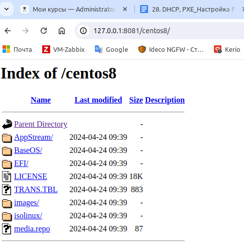

# Домашние задание Vagrant-стенд c PXE

## Цель домашнего задания
Отработать навыки установки и настройки DHCP, TFTP, PXE загрузчика и автоматической загрузки

Описание домашнего задания

1. Следуя шагам из документа https://docs.centos.org/en-US/8-docs/advanced-install/assembly_preparing-for-a-network-install  установить и настроить загрузку по сети для дистрибутива CentOS 8.
В качестве шаблона воспользуйтесь репозиторием https://github.com/nixuser/virtlab/tree/main/centos_pxe 
2. Поменять установку из репозитория NFS на установку из репозитория HTTP.
3. Настроить автоматическую установку для созданного kickstart файла (*) Файл загружается по HTTP.

## Vagrantfile

```
# -*- mode: ruby -*-
# vi: set ft=ruby :
# export VAGRANT_EXPERIMENTAL="disks"

Vagrant.configure("2") do |config|

config.vm.define "pxeserver" do |server|
  server.vm.box = 'bento/centos-8.4'
  server.vm.disk :disk, size: "15GB", name: "extra_storage1"

  server.vm.host_name = 'pxeserver'
  server.vm.network :private_network, 
                     ip: "10.0.0.20", 
                     virtualbox__intnet: 'pxenet'
  server.vm.network :private_network, ip: "192.168.56.10", adapter: 3

  # server.vm.network "forwarded_port", guest: 80, host: 8081

  server.vm.provider "virtualbox" do |vb|
    vb.memory = "1024"
    vb.customize ["modifyvm", :id, "--natdnshostresolver1", "on"]
  end

  # ENABLE to setup PXE
#  server.vm.provision "shell",
#    name: "Setup PXE server",
#    path: "setup_pxe.sh"
  end


# config used from this
# https://github.com/eoli3n/vagrant-pxe/blob/master/client/Vagrantfile
  config.vm.define "pxeclient" do |pxeclient|
    pxeclient.vm.box = 'bento/centos-8.4'
    pxeclient.vm.host_name = 'pxeclient'
    pxeclient.vm.network :private_network, ip: "10.0.0.21"
    pxeclient.vm.provider :virtualbox do |vb|
      vb.memory = "2048"
      vb.customize ["modifyvm", :id, "--natdnshostresolver1", "on"]
      vb.customize [
          'modifyvm', :id,
          '--nic1', 'intnet',
          '--intnet1', 'pxenet',
          '--nic2', 'nat',
          '--boot1', 'net',
          '--boot2', 'none',
          '--boot3', 'none',
          '--boot4', 'none'
        ]
    vb.customize ["modifyvm", :id, "--natdnshostresolver1", "on"]
    end
      # ENABLE to fix memory issues
    # endvirt  
  end

end
```
Данный Vagrantfile развернет нам 2 хоста: pxeserver и pxeclient:

```
root@o0kml-pc:/home/o0kml/dhcp_pxe# vagrant status
Current machine states:

pxeserver                 running (virtualbox)
pxeclient                 running (virtualbox)

```
Теперь мы приступаем к настройке PXE-сервера.
Для настроки хоста с помощью Ansible создадим необходимые файлы и структуру директорий в отдельной папке ansible:

Создадим конфигурационный файл ansible.cfg, который описывает базовые настройки для работы Ansible:

```
root@o0kml-pc:/home/o0kml/dhcp_pxe/ansible# cat ansible.cfg 
[defaults]
#Отключение проверки ключа хоста
host_key_checking = false
#Указываем имя файла инвентаризации
inventory = hosts
#Отключаем игнорирование предупреждений
command_warnings= false
#remote_user = vagrant
#retry_files_enabled = False
```
Создадим файл инвентаризации hosts
```
root@o0kml-pc:/home/o0kml/dhcp_pxe/ansible# cat hosts 
[servers]
pxeserver ansible_host=192.168.56.10 ansible_user=vagrant ansible_ssh_private_key_file=.vagrant/machines/pxeserver/virtualbox/private_key
```
Создадим файл playbook.yml — основной файл, в котором содержатся инструкции (модули) по настройке для Ansible:
```
root@o0kml-pc:/home/o0kml/dhcp_pxe/ansible# cat playbook.yml 
---
- name: CentOS_PXE | Set up PXE Server
  #Указываем имя хоста или группу, которые будем настраивать
  hosts: pxeserver
  #Параметр выполнения модулей от root-пользователя
  become: true

  roles:
    - { role: dhcp_pxe, when: ansible_system == 'Linux' }
```
Создадим директорий roles и структуру директорий dhcp_pxe:
```
root@o0kml-pc:/home/o0kml/dhcp_pxe/ansible# mkdir ./roles && cd ./roles
root@o0kml-pc:/home/o0kml/dhcp_pxe/ansible/roles#  ansible-galaxy init dhcp_pxe
- Role dhcp_pxe was created successfully
```
## Настройка Web-сервера

Для того, чтобы отдавать файлы по HTTP нам потребуется настроенный веб-сервер.

Процесс настройки вручную: 
Так как у CentOS 8 закончилась поддержка, для установки пакетов нам потребуется поменять репозиторий. Сделать это можно с помощью следующих команд:

```
sed -i 's/mirrorlist/#mirrorlist/g' /etc/yum.repos.d/CentOS-Linux-*
sed -i 's|#baseurl=http://mirror.centos.org|baseurl=http://vault.centos.org|g' /etc/yum.repos.d/CentOS-Linux-*
```
## 1. Устанавливаем Web-сервер Apache:
```
yum install httpd
```
## 2. Далее скачиваем образ CentOS 8.4.2150:
```
wget https://mirror.sale-dedic.com/centos/8.4.2105/isos/x86_64/CentOS-8.4.2105-x86_64-dvd1.iso
```
## 3. Монтируем данный образ:

```
mount -t iso9660 CentOS-8.4.2105-x86_64-dvd1.iso /mnt -o loop,ro
```
## 4. Создаём каталог /iso и копируем в него содержимое данного каталога:
```
mkdir /iso
cp -r /mnt/* /iso
```
## 5. Ставим права 755 на каталог /iso:

```
chmod -R 755 /iso
```
6. Настраиваем доступ по HTTP для файлов из каталога /iso:
● Создаем конфигурационный файл:
```
vi /etc/httpd/conf.d/pxeboot.conf
```
● Добавляем следующее содержимое в файл:
```
Alias /centos8 /iso
#Указываем адрес директории /iso
<Directory /iso>
    Options Indexes FollowSymLinks
    #Разрешаем подключения со всех ip-адресов
    Require all granted
</Directory>
```
● Перезапускаем веб-сервер:
```
systemctl restart httpd
```
● Добавляем его в автозагрузку:
```
systemctl enable httpd
```
7. Проверяем, что веб-сервер работает и каталог /iso доступен по сети:
● С нашего компьютера сначала подключаемся к тестовой странице Apache:



Если файлы доступны, значит веб-сервер настроен корректно.

## Настройки Веб-сервера в Ansible

```
root@o0kml-pc:/home/o0kml/dhcp_pxe/ansible# cat playbook.yml 
---
- name: CentOS_PXE | Set up PXE Server
  #Указываем имя хоста или группу, которые будем настраивать
  hosts: pxeserver
  #Параметр выполнения модулей от root-пользователя
  become: true

  roles:
    - { role: dhcp_pxe, when: ansible_system == 'Linux' }
```
```
root@o0kml-pc:/home/o0kml/dhcp_pxe/ansible# cat ./roles/dhcp_pxe/tasks/main.yml 
---
# tasks file for dhcp_pxe

- include_tasks: web.yml

- include_tasks: tftp.yml

- include_tasks: dhcp.yml

- include_tasks: ks.yml

```
```
root@o0kml-pc:/home/o0kml/dhcp_pxe/ansible# cat ./roles/dhcp_pxe/tasks/web.yml
---
# tasks file for dhcp_pxe

#sed -i 's/mirrorlist/#mirrorlist/g' /etc/yum.repos.d/CentOS-Linux-*
- name: set up repo
  replace:
    path: "{{ item }}"
    regexp: 'mirrorlist'
    replace: '#mirrorlist'
  loop:
  - /etc/yum.repos.d/CentOS-Linux-AppStream.repo
  - /etc/yum.repos.d/CentOS-Linux-BaseOS.repo

#sed -i 's|#baseurl=http://mirror.centos.org|baseurl=http://vault.centos.org|g' /etc/yum.repos.d/CentOS-Linux-*
- name: set up repo
  replace:
    path: "{{ item }}"
    regexp: '#baseurl=http://mirror.centos.org'
    replace: 'baseurl=http://vault.centos.org'
  loop:
  - /etc/yum.repos.d/CentOS-Linux-AppStream.repo
  - /etc/yum.repos.d/CentOS-Linux-BaseOS.repo

#Установка пакета httpd (дополнительно сразу ставятся все пакеты, которые потребуются в данном задании)
- name: install softs on CentOS
  yum:
    name:
    - vim
    - wget
    - epel-release
    - httpd
    - tftp-server
    - dhcp-server
    state: present
    update_cache: true

#Скачивание образа CentOS-8.4.2105-x86_64-dvd1.iso
#Скачиваться будет долго, размер файла больше 9 ГБ.
- name: Download ISO image CentOS 8.4.2105
  get_url:
    url: http://mirror.sale-dedic.com/centos/8.4.2105/isos/x86_64/CentOS-8.4.2105-x86_64-dvd1.iso
    dest: ~/CentOS-8.4.2105-x86_64-dvd1.iso
    mode: '0755'

#Создание каталога /iso и назначение прав 755
- name: Create ISO directory
  file:
    path: /iso
    state: directory
    mode: '0755'

#Монтируем образ в каталог /mnt
- name: Mount ISO image
  mount:
    path: /mnt
    src: /root/CentOS-8.4.2105-x86_64-dvd1.iso
    fstype: iso9660
    opts: ro,loop
    state: mounted

#Копируем все файлы из каталога /mnt в /iso
- name: copy ALL files from /mnt to /iso
  copy:
    src: /mnt/
    dest: /iso
    remote_src: yes
    directory_mode: yes

#Копируем конфгурационный файл pxeboot.conf (Файл должен быть предварительно создан в каталаге templates)
- name: set up httpd config
  copy:
    src: pxeboot.conf
    dest: /etc/httpd/conf.d/pxeboot.conf
    owner: root
    group: root
    mode: 0640
  notify:
  - restart httpd

```

```
root@o0kml-pc:/home/o0kml/dhcp_pxe/ansible# cat ./roles/dhcp_pxe/handlers/main.yml
---
# handlers file for dhcp_pxe

---
# handlers file for dhcp_pxe

#Перезупускаем httpd и добавляем службу в автозагрузку
- name: restart httpd
  service:
    name: httpd
    state: restarted
    enabled: true

```
На этом настройка веб-сервера завершена.

## Настройка TFTP-сервера

1. Устанавлием tftp-сервер:
```
yum install tftp-server
```
2. Запускаем службу:
```
systemctl start tftp.service
```
3. Проверяем, в каком каталоге будут храиться файлы, которые будет отдавать TFTP-сервер:
```
[root@pxeserver ~]# systemctl status tftp.service
● tftp.service - Tftp Server
   Loaded: loaded (/usr/lib/systemd/system/tftp.service; indirect; vendor preset: disabled)
   Active: active (running) since Wed 2024-04-24 10:01:16 UTC; 9s ago
     Docs: man:in.tftpd
 Main PID: 11225 (in.tftpd)
    Tasks: 1 (limit: 4953)
   Memory: 192.0K
   CGroup: /system.slice/tftp.service
           └─11225 /usr/sbin/in.tftpd -s /var/lib/tftpboot

Apr 24 10:01:16 pxeserver systemd[1]: Started Tftp Server.

```
В статусе видим, что рабочий каталог /var/lib/tftpboot.

4. Созаём каталог, в котором будем хранить наше меню загрузки:
```
mkdir /var/lib/tftpboot/pxelinux.cfg
```
5. Создаём меню-файл:
```
[root@pxeserver ~]# cat /var/lib/tftpboot/pxelinux.cfg/default
default menu.c32
prompt 0
#Время счётчика с обратным отсчётом (установлено 15 секунд)
timeout 150
#Параметр использования локального времени
ONTIME local
#Имя «шапки» нашего меню
menu title OTUS PXE Boot Menu
       #Описание первой строки
       label 1
       #Имя, отображаемое в первой строке
       menu label ^ Graph install CentOS 8.4
       #Адрес ядра, расположенного на TFTP-сервере
       kernel /vmlinuz
       #Адрес файла initrd, расположенного на TFTP-сервере
       initrd /initrd.img
       #Получаем адрес по DHCP и указываем адрес веб-сервера
       append ip=enp0s3:dhcp inst.repo=http://10.0.0.20/centos8
       label 2
       menu label ^ Text install CentOS 8.4
       kernel /vmlinuz
       initrd /initrd.img
       append ip=enp0s3:dhcp inst.repo=http://10.0.0.20/centos8 text
       label 3
       menu label ^ rescue installed system
       kernel /vmlinuz
       initrd /initrd.img
       append ip=enp0s3:dhcp inst.repo=http://10.0.0.20/centos8 rescue
```
6. Распакуем файл syslinux-tftpboot-6.04-5.el8.noarch.rpm:
```
rpm2cpio /iso/BaseOS/Packages/syslinux-tftpboot-6.04-5.el8.noarch.rpm | cpio -dimv
```
7. После распаковки в каталоге пользователя root будет создан каталог tftpboot из которого потребуется скопировать следующие файлы:

- pxelinux.0
- ldlinux.c32
- libmenu.c32
- libutil.c32
- menu.c32
- vesamenu.c32
```
cd tftpboot
cp pxelinux.0 ldlinux.c32 libmenu.c32 libutil.c32 menu.c32 vesamenu.c32 /var/lib/tftpboot/
```
8. Также в каталог /var/lib/tftpboot/ нам потребуется скопировать файлы initrd.img и vmlinuz, которые располагаются в каталоге /iso/images/pxeboot/:
```
cp /iso/images/pxeboot/{initrd.img,vmlinuz} /var/lib/tftpboot/
```
9. Далее перезапускаем TFTP-сервер и добавляем его в автозагрузку:
```
systemctl restart tftp.service
systemctl enable tftp.service
```
## Настройка TFTP-сервера в Ansible:

