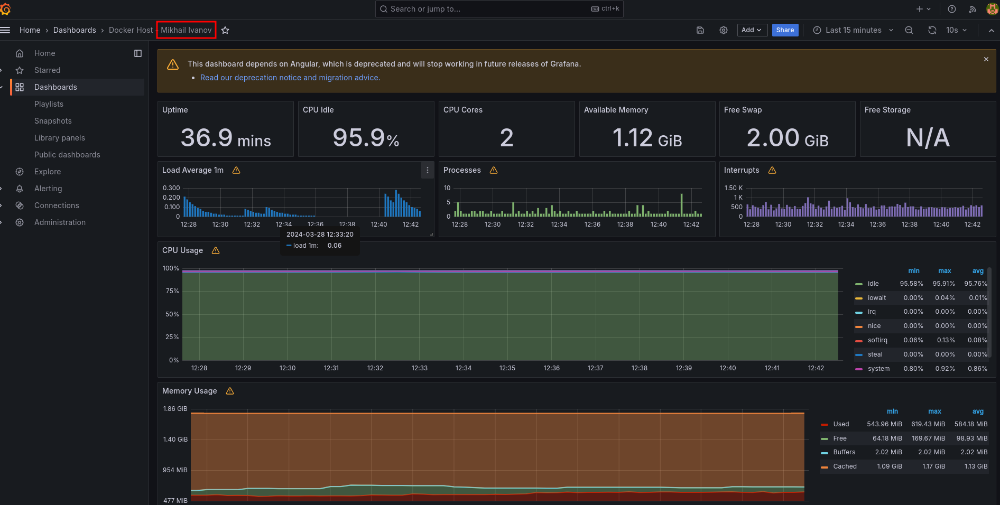

## Настройка мониторинга Prometheus

Настроить дашборд с 4-мя графиками
* память;
* процессор;
* диск;
* сеть.

Готовые сборки берем [dockprom](https://github.com/stefanprodan/dockprom).

```
git clone https://github.com/stefanprodan/dockprom
cd dockprom
ADMIN_USER='admin' ADMIN_PASSWORD='admin' ADMIN_PASSWORD_HASH='$2a$14$1l.IozJx7xQRVmlkEQ32OeEEfP5mRxTpbDTCTcXRqn19gXD8YK1pO' docker-compose up -d
```
Проверяем доступность UI прометеуса: *http://192.168.100.2/:9090* (логин и пароль admin/admin).

Заходим в Grafana: *http://192.168.100.2/:3000* (логин и пароль admin/admin).


